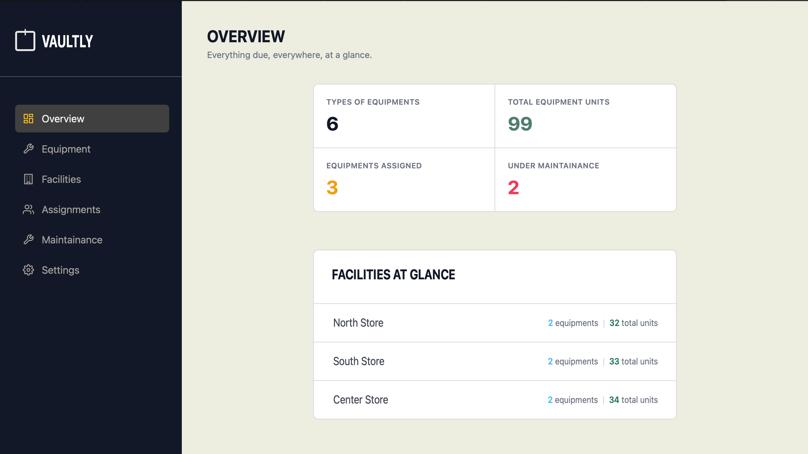
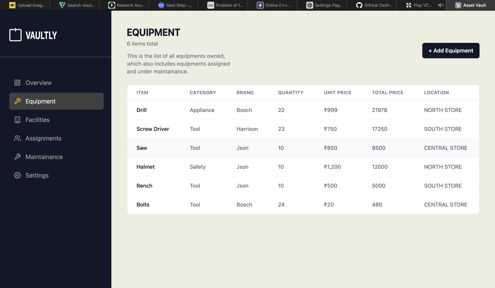
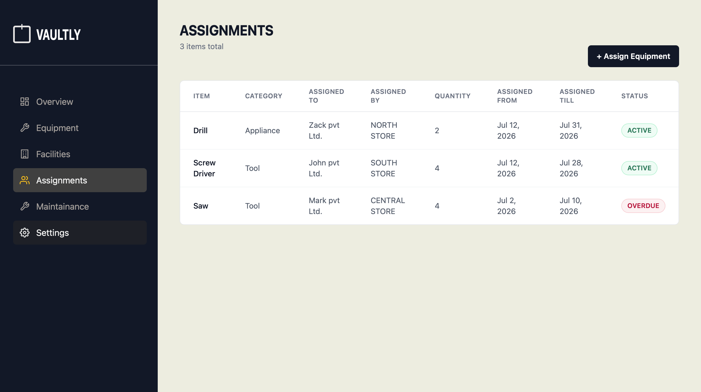
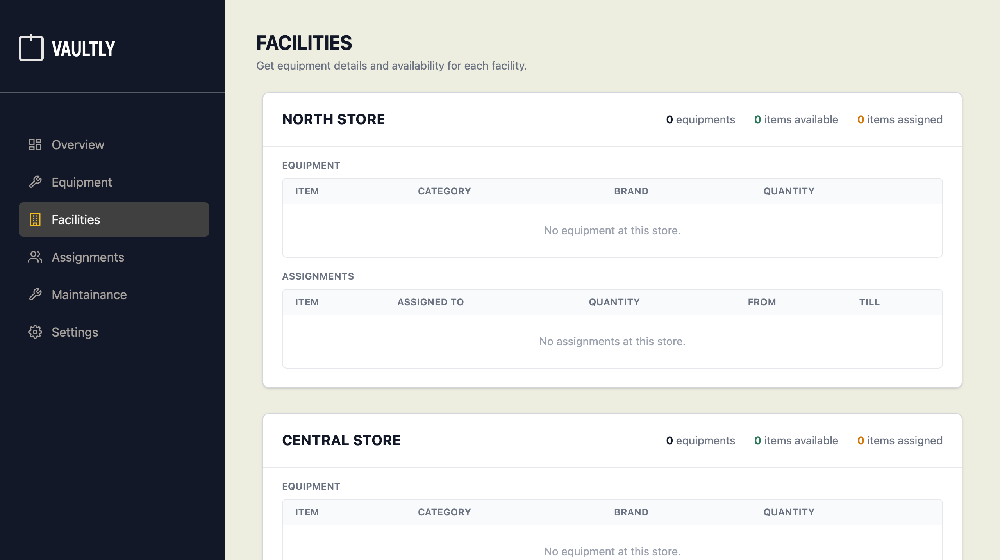
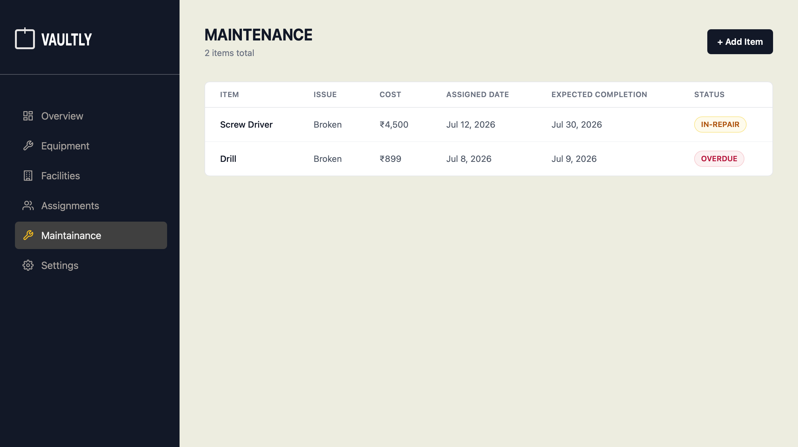

# Vaultly

> Track every piece of equipment across multiple facilities — who has it, where it lives, and what needs repair — in one dashboard.



**Live demo → https://assetvault-nu.vercel.app**

## Features
- Facility sign-in with secure authentication
- Track equipment inventory across multiple stores/facilities (brand, quantity, unit price, location)
- Assign equipment to external parties with start/end dates and live status (Active / Overdue)
- Log maintenance and repair issues with cost tracking and expected completion dates
- Facility-level breakdown showing equipment and assignments per location
- At-a-glance dashboard: total equipment types, units, active assignments, and items under maintenance

## Tech Stack
MongoDB · Express · React (Vite) · Node.js · JWT Auth · Vercel (frontend) · Render (backend)

## Quick Start

```bash
git clone https://github.com/damangulati18-maker/assetvault && cd assetvault

# Backend
cd server
cp .env.example .env   # fill in your MongoDB URI
npm install
npm start              # runs on http://localhost:5004

# Frontend (in a new terminal)
cd ../client
cp .env.example .env   # fill in your backend API URL
npm install
npm run dev             # runs on http://localhost:5173
```

## Environment Variables

**server/.env**
| Variable | Description |
| --- | --- |
| MONGODB_URI | MongoDB Atlas connection string |
| CLIENT_URL | Frontend origin, used for CORS |
| PORT | Server port (defaults to 5004 locally; Render sets this automatically in production) |

**client/.env**
| Variable | Description |
| --- | --- |
| VITE_API_URL | Backend API base URL |

## Demo Credentials
> Add your seeded demo login here once created, e.g.:
> Email: demo@demo.com
> Password: demo1234

## Screenshots

**Equipment inventory**


**Assignments**


**Facilities**


**Maintenance tracking**


## Architecture
See [docs/architecture.md](docs/architecture.md) for the data model and key design decisions.

## License
MIT — see [LICENSE](LICENSE)

---
Built as part of the [Digital Heroes](https://github.com/damangulati18-maker) Full Stack Developer Trial.